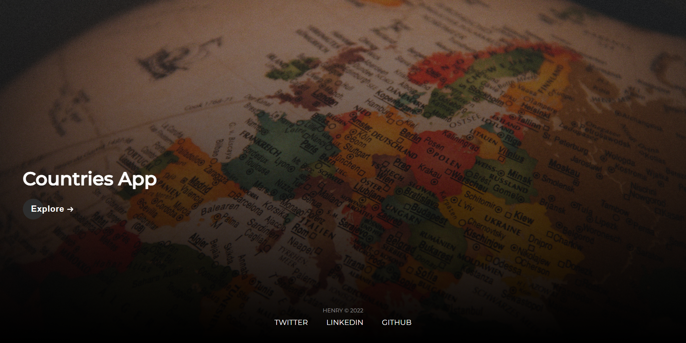
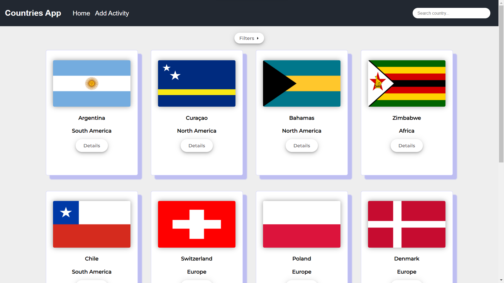
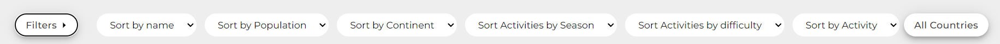
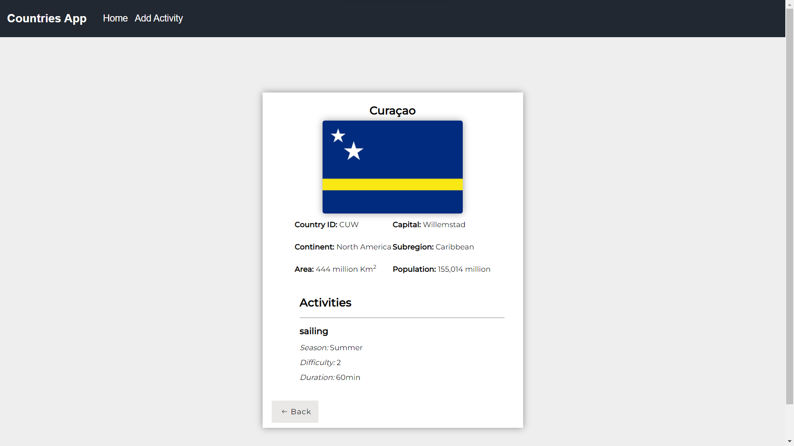
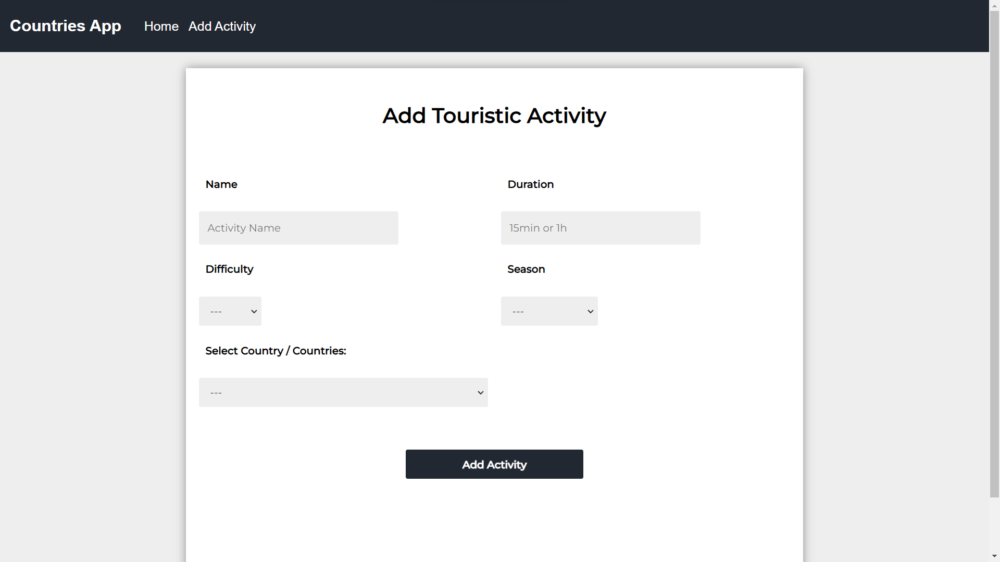

    

# Individual Project - Henry Countries
<link href="https://countries-main-app.vercel.app/" target="blank" />

  

## Description
This is the individual project carried out during Henry's Labs stage. It is a Single Page Application (SPA) (it is responsive), it was developed using React, Redux, Express, a PostgreSQL database. [(REST Countries)](https://restcountries.com/) API was used to obtain the necessary information. In the SPA, searches can be made to obtain data on countries, it can also be filtered alphabetically, by population size and by activities that can be carried out in a specific country, as well as create tourist activities. 

## Technologies

* Axios
* CSS
* Express
* JavaScript
* Node.js
* PostgreSQL
* React
* Redux
* Sequelize

## Installation
* Clone or fork the repository
* Install dependencies using npm install or yarn install (depending on your preference)
* Run the project using npm start or yarn start (depending on your preference)

## Configuring the database

Create an .env file in the /api folder with the following parameters:

>DB_USER= postgresUser  
>DB_PASSWORD= postgresPassword  
>DB_HOST=localhost  

Replace <i>postgresUser</i> and <i>postgresPassword</i> with your database credentials to connect to PostgreSQL.

It must be necessary to create the countries database in ProgreSQL.

Once done, you can now perform npm install in the API folder, so that all the necessary dependencies are installed.

To bring the server online, run npm start.

## Configuring the Frontend

For the front, no additional configurations are required. Run npm install in the Client folder and then npm start to launch the application.

## Presentation and functionalities

### Home

  

  

The main view shows a navbar with its respective search field to query countries by their names, as well as the first 9 results returned by the database. The filter button is dropdown and allows access to the various filters that are available. It has a pagination at the bottom.

### Country Details

  

In the details view of the country, the characteristics inherent to said country and the registered activities are shown.

### Create Activity

  

Activity creation form. It is a controlled form, JavaScript was used for validation. If a field is empty, the form shows an error message, and if on the contrary, everything is fine, it shows a success message that the activity was successfully created.
